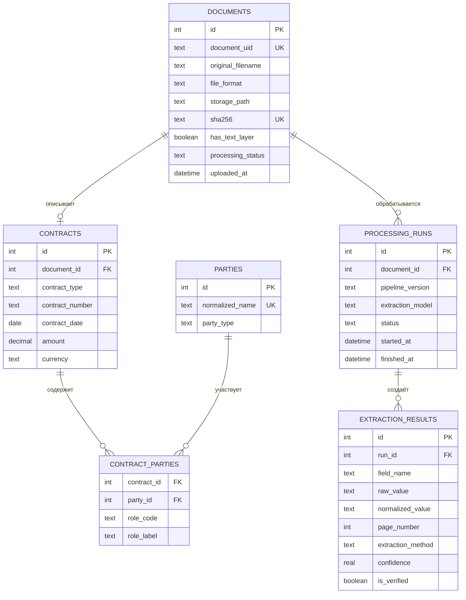
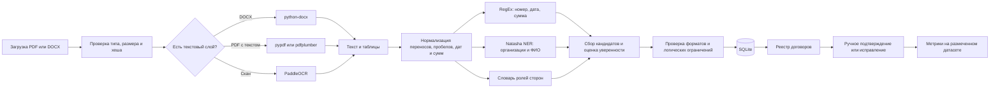

# Материалы к показу проекта

## 1. Что делает система

Система принимает договор в PDF или DOCX и извлекает пять значений: номер, дату, две стороны и сумму. Вместе с итогом сохраняются исходный фрагмент текста, способ извлечения и уверенность алгоритма. Пользователь видит реестр и при необходимости исправляет результат.

## 2. Схема базы данных

Почему не одна таблица: документ можно обрабатывать несколько раз разными версиями парсера; у договора могут быть разные названия ролей сторон; для отладки нужно видеть не только итог, но и источник каждого найденного значения.

Полный SQL находится в `schema_v2.sql`. Для прототипа используем SQLite, при многопользовательской работе можно перейти на PostgreSQL без изменения логической схемы.

## 3. Пайплайн обработки

Текущий парсер реализует чтение, нормализацию и RegEx-извлечение. На 20 простых шаблонах он показывал 100%, а после добавления 60 разнообразных договоров полная точность упала до 25%. Это обосновывает следующий этап — обработку ролей сторон, нескольких кандидатов и контекста.

## 4. Какие модели и инструменты используем

| Задача | Решение сейчас | Почему |
|---|---|---|
| Номер договора | RegEx + ключевые слова | Поле формальное, модель не требуется |
| Дата | RegEx + нормализация в ISO | Легко проверять календарные ограничения |
| Сумма | RegEx + денежный нормализатор | Можно учитывать «руб.», пробелы, НДС и копейки |
| Организации и ФИО | Natasha / Slovnet NER | Компактная русскоязычная NER-модель |
| Роли сторон | Словарь ролей + контекстные правила | Встречаются заказчик, покупатель, арендатор, принципал и т. д. |
| PDF и DOCX с текстом | pypdf/pdfplumber и python-docx | Быстро, локально и воспроизводимо |
| Сканированные документы | PaddleOCR, отдельная ветка | OCR нужен только там, где нет текстового слоя |
| Контрольное сравнение | spaCy `ru_core_news_lg` | Можно сравнить качество второй готовой NER-модели |
| Дальнейшее развитие | LayoutLMv3 или аналогичный layout-aware transformer | Учитывает одновременно текст и положение на странице |

### Итоговый выбор для MVP

На первом рабочем этапе используем гибрид: **RegEx + нормализация + Natasha + словарь ролей**. Это можно объяснить, отладить и измерить на текущих 80 документах. Большую нейросеть сейчас не обучаем: выборка слишком маленькая, а задача на формальных полях хорошо решается комбинацией правил и готовой NER-модели.

PaddleOCR подключаем после добавления сканов. LayoutLMv3 рассматриваем как следующий исследовательский этап, когда появятся сотни или тысячи размеченных страниц и координаты полей.

## 5. Короткий текст для защиты

> Мы строим гибридный парсер договоров. Формальные поля — номер, дата и сумма — извлекаются регулярными выражениями и нормализуются. Для названий организаций и ФИО используем готовую русскоязычную NER-модель Natasha, а юридические роли определяем словарём и контекстом. PDF и DOCX с текстовым слоем читаются напрямую, для сканов предусмотрена отдельная OCR-ветка. Результат и история каждого запуска сохраняются в SQLite. Позже, когда разметки станет больше, можно сравнить это решение с LayoutLMv3, который учитывает расположение текста на странице.

## Источники по выбранным моделям

- Natasha: https://natasha.github.io/
- spaCy Russian pipelines: https://spacy.io/usage/models
- PaddleOCR: https://github.com/PaddlePaddle/PaddleOCR
- LayoutLMv3 paper: https://arxiv.org/abs/2204.08387

